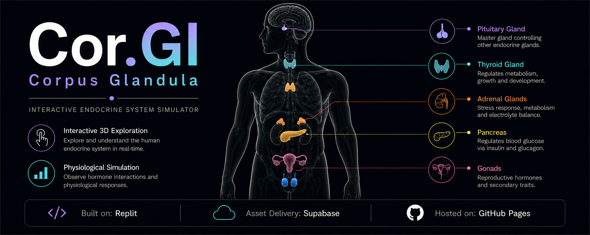

  

# 🧬 EndoX — Corpus Glandula

Interactive endocrine system simulator visualizing human glands, hormonal regulation, and physiological responses.

---

## ✨ Features

* **Interactive 3D Anatomy:** Explore the human endocrine system through a rotatable body model.
* **Hormone Simulations:** Visualize physiological responses using real-time interactive controls.
* **Educational Workflow:** Browser-based interface designed for scientific accuracy.
* **Responsive Design:** Optimized for desktop and mobile devices.

---

## 🚀 Build & Hosting

* **Repository:** Replit
* **Hosting:** Github Pages

---

## 🛠️ Credits & Acknowledgments

* **Claude Opus 4.8:** Code generation & architecture.
* **Replit:** Code improvisation & rapid prototyping.
* **OpenAI:** Scientific debugging, testing & logic optimization.
* **Supabase** Asset Delivery.
---

## 👤 Author

* **Draven Ashcroft**
  * M.Sc. Ag. Entomology, ASRB NET
  * DIPS Chain of Institutions

---

## 📜 License

GPL-3.0
